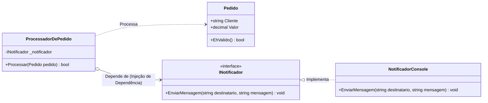
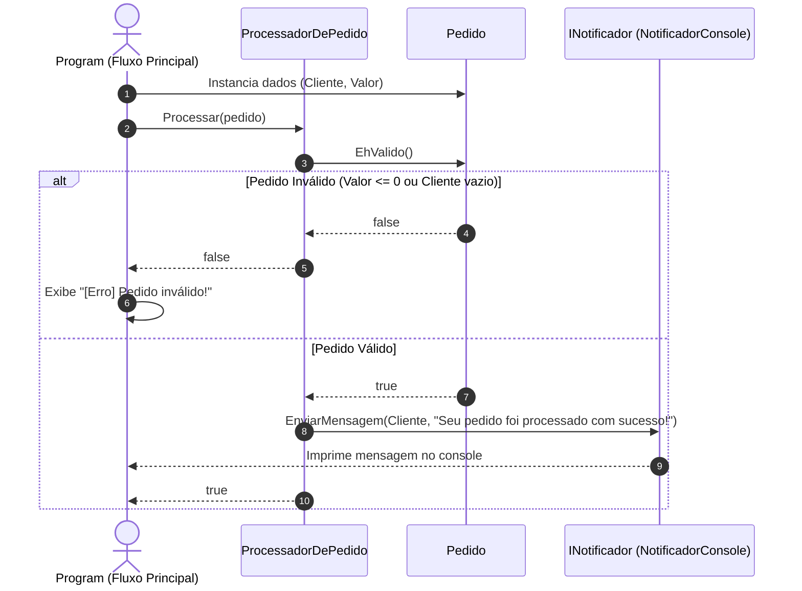

# 📦 Seminário SOLID: Princípios de Design e Boas Práticas em C#

Projeto demonstrativo desenvolvido para apresentação e estudo de princípios de engenharia de software e boas práticas de Orientação a Objetos, destacando os princípios **SOLID** e o conceito **KISS** (*Keep It Simple, Stupid*) aplicados em **C# / .NET 8**.

---

## 🎯 Objetivo do Projeto

O objetivo deste projeto é demonstrar, de forma prática, didática e sem complexidade desnecessária, como estruturar um fluxo de negócio simples (processamento e notificação de pedidos) aplicando princípios fundamentais de arquitetura e design de software:

- **SRP (*Single Responsibility Principle*)**: Cada classe tem um único propósito e uma única razão para mudar.
- **DIP (*Dependency Inversion Principle*)**: Módulos de alto nível dependem de abstrações (interfaces), promovendo baixo acoplamento e alta testabilidade.
- **OCP (*Open/Closed Principle*)**: O sistema é aberto para extensão (novos canais de notificação) e fechado para modificação.
- **KISS (*Keep It Simple, Stupid*)**: O fluxo principal é limpo, direto e sem sobrecarga estrutural desnecessária.

---

## 🛠️ Tecnologias Utilizadas

- **Linguagem:** C# 12
- **Plataforma:** .NET 8.0 (Console Application)
- **Recursos Modernos do C#:**
  - *Top-level Statements* (ponto de entrada simplificado)
  - *Required Properties* (`required string Cliente`)
  - *Nullable Reference Types*

---

## 📐 Arquitetura e Diagramas

### Diagrama de Classes



### Diagrama de Sequência (Fluxo de Execução)



---

## 🧠 Princípios Aplicados no Código

### 1. Princípio KISS (*Keep It Simple, Stupid*)
O ponto de entrada em `Program.cs` compõe os componentes e executa a operação diretamente, sem a necessidade de contêineres de injeção de dependência complexos ou frameworks externos desnecessários para o escopo do seminário:

```csharp
var notificador = new NotificadorConsole();
var processador = new ProcessadorDePedido(notificador);

var pedido = new Pedido
{
    Cliente = "Tio Bob",
    Valor = 350.90m
};

bool sucesso = processador.Processar(pedido);
```

### 2. SRP (*Single Responsibility Principle* — Responsabilidade Única)
- **`Pedido`**: Tem a responsabilidade exclusiva de representar o estado de um pedido e verificar a integridade básica dos seus próprios dados através do método `EhValido()`. A classe não se preocupa em enviar mensagens, persistir em banco de dados ou formatar telas.
- **`ProcessadorDePedido`**: Tem a responsabilidade única de orquestrar a lógica do processamento de um pedido (validar e acionar a notificação).
- **`NotificadorConsole`**: Tem a responsabilidade única de emitir a notificação no meio de saída correspondente (neste caso, o terminal).

```csharp
public class Pedido
{
    public required string Cliente { get; set; }
    public decimal Valor { get; set; }

    public bool EhValido()
    {
        return Valor > 0 && !string.IsNullOrWhiteSpace(Cliente);
    }
}
```

### 3. DIP (*Dependency Inversion Principle* — Inversão de Dependência)
- **Abstração:** Criamos o contrato `INotificador`:
  ```csharp
  public interface INotificador
  {
      void EnviarMensagem(string destinatario, string mensagem);
  }
  ```
- **Injeção de Dependência via Construtor:** A classe de alto nível `ProcessadorDePedido` não depende diretamente da implementação concreta `NotificadorConsole`, mas sim da interface `INotificador`:
  ```csharp
  public class ProcessadorDePedido
  {
      private readonly INotificador _notificador;

      public ProcessadorDePedido(INotificador notificador)
      {
          _notificador = notificador;
      }
      // ...
  }
  ```
Isso desacopla os componentes e permite alterar o mecanismo de notificação ou criar testes unitários com *mocks/stubs* sem precisar modificar a classe `ProcessadorDePedido`.

---

## 🧩 Detalhamento dos Componentes

| Componente | Tipo | Responsabilidade |
| :--- | :--- | :--- |
| **`Pedido`** | Classe | Modela os dados do pedido (`Cliente`, `Valor`) e provê o método de auto-validação `EhValido()`. |
| **`INotificador`** | Interface | Define o contrato de comunicação (`EnviarMensagem`), desacoplando o emissor da implementação. |
| **`NotificadorConsole`** | Classe | Implementação concreta de `INotificador` que escreve as notificações no `Console`. |
| **`ProcessadorDePedido`** | Classe | Serviço que valida o pedido e, caso válido, dispara a notificação via `INotificador`. |
| **`Program.cs`** | Arquivo principal | Ponto de entrada (*top-level statements*) onde os objetos são instanciados e o fluxo é executado. |

---

## 🚀 Como Executar o Projeto

### Pré-requisitos
- [.NET SDK 8.0](https://dotnet.microsoft.com/download) ou superior instalado.
- Terminal / Linha de comando ou uma IDE compatível (Visual Studio, VS Code ou Rider).

### Execução passo a passo

1. **Clone o repositório:**
   ```bash
   git clone https://github.com/LeomarAlves/SeminarioSolid.git
   cd SeminarioSolid
   ```

2. **Compile o projeto:**
   ```bash
   dotnet build
   ```

3. **Execute a aplicação:**
   ```bash
   dotnet run
   ```

4. **Saída esperada (Cenário de Sucesso):**
   ```text
   [Notificação] Para Tio Bob: Seu pedido foi processado com sucesso!
   ```

---

## 🧪 Testando Cenários

No arquivo `Program.cs`, é possível alternar entre os cenários comentando/descomentando as instâncias de `Pedido`:

### Cenário 1: Pedido Válido (Padrão)
```csharp
var pedido = new Pedido
{
    Cliente = "Tio Bob",
    Valor = 350.90m
};
// Saída: [Notificação] Para Tio Bob: Seu pedido foi processado com sucesso!
```

### Cenário 2: Pedido Inválido
Ao utilizar um valor menor ou igual a zero, ou nome de cliente em branco:
```csharp
var pedido = new Pedido
{
    Cliente = "João",
    Valor = 0
};
// Saída: [Erro] Pedido inválido!
```

---

## 🔌 Exemplo de Extensibilidade (Princípio Aberto/Fechado - OCP)

Graças ao desacoplamento através de `INotificador`, para adicionar um novo meio de notificação (por exemplo, envio por WhatsApp ou E-mail), **não é necessário modificar a classe `ProcessadorDePedido`**. Basta implementar a interface em uma nova classe:

```csharp
public class NotificadorEmail : INotificador
{
    public void EnviarMensagem(string destinatario, string mensagem)
    {
        // Lógica de envio por E-mail (SMTP, SendGrid, etc.)
        Console.WriteLine($"[E-mail enviado para {destinatario}]: {mensagem}");
    }
}
```

E no fluxo principal, basta injetar a nova implementação:
```csharp
var notificadorEmail = new NotificadorEmail();
var processador = new ProcessadorDePedido(notificadorEmail);
```

---

## 📁 Estrutura de Arquivos

```text
SeminarioSolid/
├── .gitignore             # Regras de exclusão do Git para projetos .NET
├── Program.cs             # Código fonte com classes, interfaces e fluxo principal
├── README.MD              # Documentação detalhada do projeto
└── SeminarioSolid.csproj  # Arquivo de configuração do projeto .NET 8
```

---

## 📄 Licença

Este projeto é disponibilizado para fins educacionais e acadêmicos.
