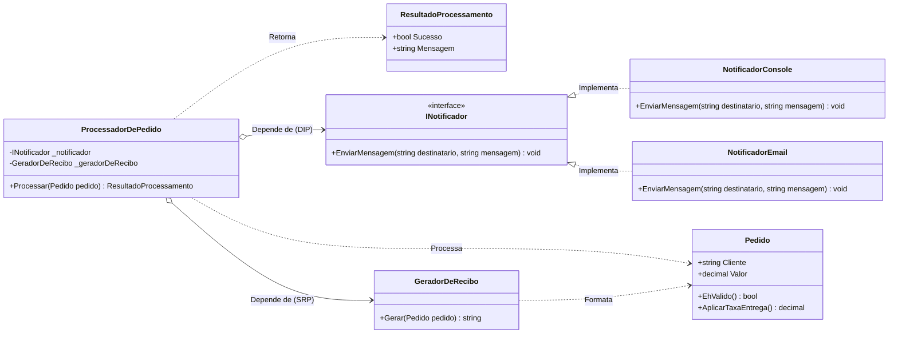
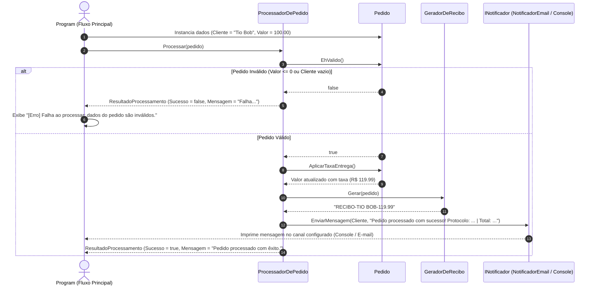

# 📦 Seminário SOLID: Princípios de Design e Boas Práticas em C#

Projeto demonstrativo desenvolvido para apresentação e estudo de princípios de engenharia de software e boas práticas de Orientação a Objetos, destacando os princípios **SOLID** e o conceito **KISS** (*Keep It Simple, Stupid*) aplicados em **C# / .NET 8**.

---

## 🎯 Objetivo do Projeto

O objetivo deste projeto é demonstrar, de forma prática, didática e sem complexidade desnecessária, como estruturar um fluxo de negócio simples (validação de pedido, cálculo de frete/taxa de entrega, formatação de recibo, notificação de pedidos e retorno padronizado de resultados) aplicando princípios fundamentais de arquitetura e design de software:

- **SRP (*Single Responsibility Principle*)**: Cada classe tem um único propósito e uma única razão para mudar:
  - `Pedido`: dados e validação de regras de domínio/taxa de entrega.
  - `GeradorDeRecibo`: formatação e emissão de comprovantes textuais.
  - `ProcessadorDePedido`: orquestração do fluxo de negócio.
  - `NotificadorConsole` / `NotificadorEmail`: transmissão da mensagem para cada canal.
- **OCP (*Open/Closed Principle*)**: O sistema é aberto para extensão e fechado para modificação (novos canais de notificação como `NotificadorEmail` são adicionados sem alterar `ProcessadorDePedido`).
- **DIP (*Dependency Inversion Principle*)**: Módulos de alto nível dependem de abstrações (`INotificador`), promovendo baixo acoplamento e facilitando testes e alternância de implementações.
- **KISS (*Keep It Simple, Stupid*)**: O fluxo principal é limpo, direto e sem sobrecarga estrutural ou frameworks desnecessários.

---

## 🛠️ Tecnologias Utilizadas

- **Linguagem:** C# 12
- **Plataforma:** .NET 8.0 (Console Application)
- **Recursos Modernos do C#:**
  - *Top-level Statements* (ponto de entrada simplificado)
  - *Required Properties* (`required string Cliente`)
  - *Nullable Reference Types*
  - Interpolação de strings formatada

---

## 📐 Arquitetura e Diagramas

### Diagrama de Classes



### Diagrama de Sequência (Fluxo de Execução)



---

## 🧠 Princípios Aplicados no Código

### 1. Princípio KISS (*Keep It Simple, Stupid*)
O ponto de entrada em `Program.cs` compõe os componentes e executa a operação diretamente, sem a necessidade de contêineres IoC pesados ou frameworks externos:

```csharp
// Graças ao DIP podemos alternar facilmente entre canais de notificação:
// INotificador notificador = new NotificadorConsole(); ou INotificador notificador = new NotificadorEmail();
INotificador notificador = new NotificadorEmail();

var geradorDeRecibo = new GeradorDeRecibo();
var processador = new ProcessadorDePedido(notificador, geradorDeRecibo);

var pedido = new Pedido
{
    Cliente = "Tio Bob",
    Valor = 100.00m
};

ResultadoProcessamento resultado = processador.Processar(pedido);

if (!resultado.Sucesso)
{
    Console.WriteLine($"[Erro] {resultado.Mensagem}");
}
```

### 2. SRP (*Single Responsibility Principle* — Responsabilidade Única)
- **`Pedido`**: Modela o domínio do pedido, valida a consistência de seus atributos (`EhValido()`) e calcula o acréscimo de entrega (`AplicarTaxaEntrega()`). Não cuida de formatação de recibos nem de envio de avisos.
- **`GeradorDeRecibo`**: Especialista em formatação e geração textual do protocolo/recibo do pedido (`RECIBO-{CLIENTE}-{VALOR}`). Desacopla as regras de formatação textual da lógica de negócio.
- **`ResultadoProcessamento`**: Encapsula os dados resultantes da operação (`Sucesso` e `Mensagem`), padronizando o retorno.
- **`ProcessadorDePedido`**: Orquestra o fluxo de processamento delegando cada tarefa para seu respectivo especialista (validação ao `Pedido`, geração ao `GeradorDeRecibo` e comunicação ao `INotificador`).
- **`NotificadorConsole` / `NotificadorEmail`**: Responsabilidade única de encaminhar a mensagem ao canal de saída adequado.

```csharp
public class Pedido
{
    public required string Cliente { get; set; }
    public decimal Valor { get; set; }

    public bool EhValido()
    {
        return Valor > 0 && !string.IsNullOrWhiteSpace(Cliente);
    }

    public decimal AplicarTaxaEntrega()
    {
        if (Valor <= 199.99m)
        {
            Valor += 19.99m;
        }

        return Valor;
    }
}

public class GeradorDeRecibo
{
    public string Gerar(Pedido pedido)
    {
        return $"RECIBO-{pedido.Cliente.ToUpper()}-{pedido.Valor:F2}";
    }
}

public class ResultadoProcessamento
{
    public bool Sucesso { get; set; }
    public string Mensagem { get; set; } = string.Empty;
}
```

### 3. DIP (*Dependency Inversion Principle* — Inversão de Dependência)
- **Abstração:** Criamos o contrato `INotificador`:
  ```csharp
  public interface INotificador
  {
      void EnviarMensagem(string destinatario, string mensagem);
  }
  ```
- **Implementações Concretas:** As classes de envio implementam a mesma abstração, demonstrando a substituição transparente de canais:
  ```csharp
  public class NotificadorConsole : INotificador
  {
      public void EnviarMensagem(string destinatario, string mensagem)
      {
          Console.WriteLine($"[Console] Para {destinatario}: {mensagem}");
      }
  }

  public class NotificadorEmail : INotificador
  {
      public void EnviarMensagem(string destinatario, string mensagem)
      {
          Console.WriteLine($"[E-mail Enviado] Para: {destinatario.ToLower().Replace(" ", ".")}@solid.com | Conteúdo: {mensagem}");
      }
  }
  ```
- **Injeção de Dependência via Construtor:** A classe `ProcessadorDePedido` depende da interface `INotificador`:
  ```csharp
  public class ProcessadorDePedido
  {
      private readonly INotificador _notificador;
      private readonly GeradorDeRecibo _geradorDeRecibo;

      public ProcessadorDePedido(INotificador notificador, GeradorDeRecibo geradorDeRecibo)
      {
          _notificador = notificador;
          _geradorDeRecibo = geradorDeRecibo;
      }
      // ...
  }
  ```
Isso desacopla os componentes e permite alterar o mecanismo de notificação ou criar testes unitários com *mocks/stubs* sem precisar modificar uma única linha de `ProcessadorDePedido`.

---

## 🧩 Detalhamento dos Componentes

| Componente | Tipo | Responsabilidade |
| :--- | :--- | :--- |
| **`Pedido`** | Classe | Modela os dados do pedido (`Cliente`, `Valor`), valida integridade (`EhValido()`) e aplica taxas (`AplicarTaxaEntrega()`). |
| **`GeradorDeRecibo`** | Classe | Serviço especialista em formatar comprovantes/recibos textuais padronizados com base no pedido. |
| **`ResultadoProcessamento`** | Classe | DTO que padroniza o retorno (`Sucesso` e `Mensagem`), facilitando tratamento de erros e respostas uniformes. |
| **`INotificador`** | Interface | Define o contrato de envio (`EnviarMensagem`), desacoplando o emissor da implementação de destino. |
| **`NotificadorConsole`** | Classe | Implementação de `INotificador` que imprime a notificação diretamente no terminal. |
| **`NotificadorEmail`** | Classe | Implementação de `INotificador` que simula o disparo de notificação por e-mail com endereço formatado. |
| **`ProcessadorDePedido`** | Classe | Orquestrador de alto nível que valida o pedido, aplica taxa, solicita a emissão do recibo e dispara a notificação via abstração. |
| **`Program.cs`** | Arquivo principal | Ponto de entrada (*top-level statements*) onde as instâncias são configuradas e o fluxo é executado. |

---

## 🚀 Como Executar o Projeto

### Pré-requisitos
- [.NET SDK 8.0](https://dotnet.microsoft.com/download) ou superior instalado.
- Terminal / Linha de comando ou uma IDE compatível (Visual Studio, VS Code ou Rider).

### Execução passo a passo

1. **Clone o repositório:**
   ```bash
   git clone https://github.com/LeomarAlves/SeminarioSolid.git
   cd SeminarioSolid
   ```

2. **Compile o projeto:**
   ```bash
   dotnet build
   ```

3. **Execute a aplicação:**
   ```bash
   dotnet run
   ```

4. **Saída esperada (Cenário Padrão configurado em `Program.cs` — Pedido de R$ 100,00 com taxa de R$ 19,99 e envio por E-mail):**
   ```text
   [E-mail Enviado] Para: tio.bob@solid.com | Conteúdo: Pedido processado com sucesso! Protocolo: RECIBO-TIO BOB-119.99 | Total: R$ 119.99
   ```

---

## 🧪 Testando Cenários

No arquivo `Program.cs`, é possível alternar e testar diferentes configurações modificando os valores de `Pedido` e a implementação de `INotificador`:

### Cenário 1: Pedido Válido com Frete Grátis (Valor >= R$ 200.00)
Pedidos com valor a partir de R$ 200,00 não recebem acréscimo de taxa de entrega:
```csharp
var pedido = new Pedido
{
    Cliente = "Tio Bob",
    Valor = 200.00m
};
// Saída com NotificadorEmail:
// [E-mail Enviado] Para: tio.bob@solid.com | Conteúdo: Pedido processado com sucesso! Protocolo: RECIBO-TIO BOB-200.00 | Total: R$ 200.00
```

### Cenário 2: Pedido Válido com Taxa de Entrega (Valor <= R$ 199.99)
Para pedidos com valor menor ou igual a R$ 199,99, o método `AplicarTaxaEntrega()` adiciona R$ 19,99 ao total do pedido:
```csharp
var pedido = new Pedido
{
    Cliente = "Tio Bob",
    Valor = 100.00m
};
// Valor original: R$ 100.00 -> Valor final com frete: R$ 119.99
// Saída com NotificadorEmail:
// [E-mail Enviado] Para: tio.bob@solid.com | Conteúdo: Pedido processado com sucesso! Protocolo: RECIBO-TIO BOB-119.99 | Total: R$ 119.99
```

### Cenário 3: Alternando para Notificação via Console (DIP na Prática)
Basta alterar a instância injetada para utilizar `NotificadorConsole`:
```csharp
INotificador notificador = new NotificadorConsole();
var geradorDeRecibo = new GeradorDeRecibo();
var processador = new ProcessadorDePedido(notificador, geradorDeRecibo);

var pedido = new Pedido
{
    Cliente = "Tio Bob",
    Valor = 100.00m
};
// Saída:
// [Console] Para Tio Bob: Pedido processado com sucesso! Protocolo: RECIBO-TIO BOB-119.99 | Total: R$ 119.99
```

### Cenário 4: Pedido Inválido
Ao utilizar um valor menor ou igual a zero, ou nome de cliente vazio / em branco:
```csharp
var pedido = new Pedido
{
    Cliente = "João",
    Valor = 0
};
// Saída:
// [Erro] Falha ao processar: dados do pedido são inválidos.
```

---

## 🔌 Extensibilidade (Princípio Aberto/Fechado - OCP)

O princípio **Open/Closed** afirma que classes devem estar abertas para extensão, mas fechadas para modificação.

Neste projeto, a introdução de `NotificadorEmail` foi feita implementando `INotificador`, sem alterar nenhuma linha de código da classe `ProcessadorDePedido`.

Da mesma forma, se precisarmos adicionar um canal via SMS ou WhatsApp no futuro, basta criar uma nova implementação da interface:

```csharp
public class NotificadorWhatsApp : INotificador
{
    public void EnviarMensagem(string destinatario, string mensagem)
    {
        // Integração com API do WhatsApp (ex: Twilio, Meta Cloud API)
        Console.WriteLine($"[WhatsApp Enviado] Para {destinatario}: {mensagem}");
    }
}
```

E no ponto de entrada:
```csharp
INotificador notificador = new NotificadorWhatsApp();
var processador = new ProcessadorDePedido(notificador, geradorDeRecibo);
```

---

## 📁 Estrutura de Arquivos

```text
SeminarioSolid/
├── .gitignore             # Regras de exclusão do Git para projetos .NET
├── Program.cs             # Código-fonte contendo entidades, serviços, interfaces e fluxo principal
├── README.MD              # Documentação detalhada do projeto e princípios arquiteturais
└── SeminarioSolid.csproj  # Configuração do projeto .NET 8
```

---

## 📄 Licença

Este projeto é disponibilizado para fins educacionais e acadêmicos.
